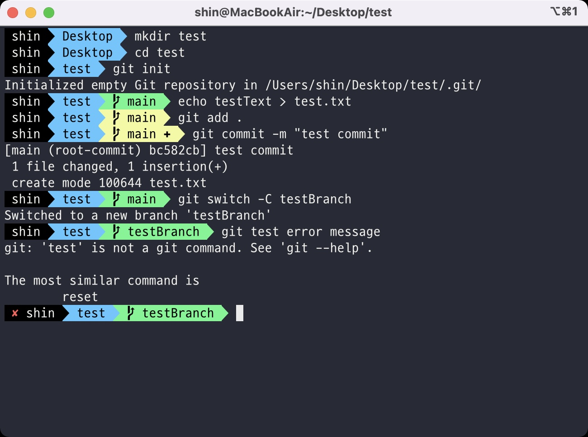

# Git과 Terminal 커스텀 세팅
- 개발자는 데스트 셋업 부터 시작하여 개발 환경을 자신에 맞게 커스텀 세팅하기를 좋아한다
- 이 포스팅은 그러한 개발자들을 위한 글이다

 
  

## Mac 유저를 위한 iTerm2 세팅
- 맥용 터미널 프로그램은 다양하게 존재하지만, 가장 유명한 것은 iTerm2이다
- 하지만 iTerm2 유저들은 단순히 기본 기능만 사용하는 것이 아니라 본인에게 편리한 테마를 이용해 작업한다
- 이를 이용하면 아래와 같이 다양한 정보를 시각적으로 보여주도록 커스텀 세팅이 가능하다

  

- [iTerm2](https://iterm2.com)
- [[개발 환경] iTerm2로 터미널 커스텀하기](https://ooeunz.tistory.com/21)
- [agnoster 테마 상대 경로 적용 방법](https://github.com/agnoster/agnoster-zsh-theme/issues/19)

 
  

## gitconfig 세팅
### excludesfile
- Mac으로 개발을 하다 보면 매번 `.DS_Store`라는 프로젝트와 전혀 관계 없는 파일이 생성되는 것을 알 수 있다
- repository마다 이 파일을 `.gitignore`하는 것은 매우 귀찮은 일이다
- `git config`에서는 전역 `.gitignore`를 생성할 수 있으며, 이에 `.gitignore`을 `git`에 유지하지 않고도 항상 특정 파일을 제외할 수 있다
- 이를 사용하려면, 터미널에서 `git config --global core.excludesFile ~/.gitignore`를 입력하면 된다
- 단, 기존과 동일하게 `~/.gitignore` 파일을 열어서 제외할 파일을 직접 입력하고 저장해 주어야 정상 작동한다
 

### defaultBranch
- Local에서 `git init`을 하였을 경우에는 Default가 master이지만, github에서는 main인 경우가 있다
- 그 이유는 github가 master 대신 main을 사용하기로 했기 때문이다 [[기사자료]](https://www.cnet.com/tech/computing/microsofts-github-is-removing-coding-terms-like-master-and-slave/)
    - 내용을 요약하자면, Black Lives Matter 운동과 관련된 언어적인 문제들을(master/slave, blacklist/whitelist) 개선하기 위해서이다
- Local에서 `git init`을 할 때 Default를 main으로 변경하려면 아래의 방법을 이용하면 된다
- `git config --global init.defaultBranch main`
